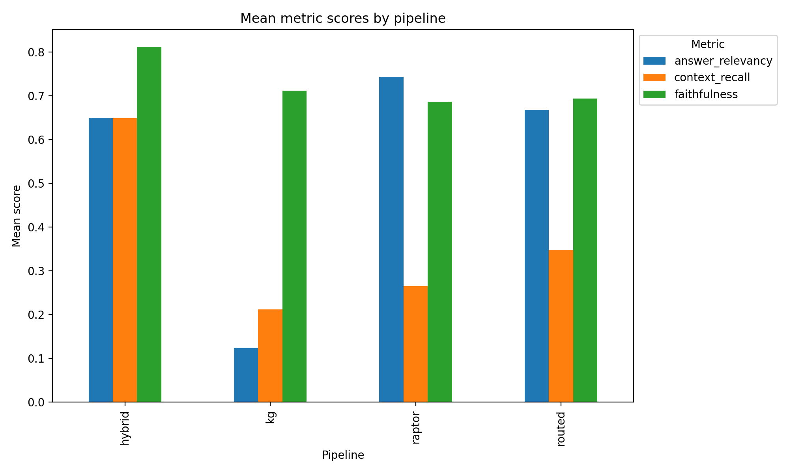
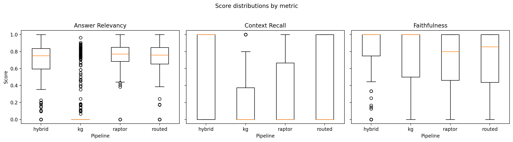

# Vietnamese Traditional Medicine RAG (Vietnamese-RAG)

**Course:** Intro to Natural Language Processing (2025–2026)

**Team members:**
- _<Your Name 1>_ (Student ID: _<...>_)
- _<Your Name 2>_ (Student ID: _<...>_)
- _<Your Name 3>_ (Student ID: _<...>_)

> Note: Replace the placeholders above with your actual names/IDs.

---

## 1. Problem definition and motivation

Vietnamese Traditional Medicine (Y học Cổ truyền Việt Nam) knowledge is scattered across scanned textbooks, lecture notes, and curated knowledge bases. Users (students, pharmacists, practitioners) often ask questions that require **grounded, source-based answers** such as:

- Definitions and classifications (e.g., “Bệnh ngoại cảm theo Đông y được định nghĩa như thế nào?”)
- Lists and structured information (symptoms, causes, treatments, advice)
- Cross-referencing between textual descriptions and structured medical entities

A vanilla LLM may hallucinate, mix sources, or generalize beyond Vietnamese Traditional Medicine content. Therefore, we build a **Retrieval-Augmented Generation (RAG)** system that:

1. Retrieves relevant evidence from **Vietnamese textbook passages** (dense retrieval over long documents).
2. Optionally queries a **medical knowledge graph** for structured facts.
3. Produces Vietnamese answers constrained to the retrieved evidence.

**Goal.** Given a Vietnamese question, generate an answer that is:
- Correct with respect to provided sources,
- Faithful to retrieved context (minimizing hallucination),
- Relevant and concise.

---

## 2. Related work

### 2.1 Retrieval-Augmented Generation (RAG)
RAG combines a retriever (sparse or dense) and a generator (LLM). The retriever fetches passages from a corpus; the generator answers conditioned on these passages. This is widely used to reduce hallucination, support attribution, and enable domain grounding.

### 2.2 RAPTOR (selected publication)
**RAPTOR** proposes a retrieval approach for long documents by building a **recursive, tree-structured index**. Documents are split into chunks, chunks are embedded, then clustered; higher-level nodes summarize clusters. Retrieval can operate over multiple levels, improving coverage for queries that require both fine-grained and high-level evidence.

This project implements a RAPTOR-like index:
- Leaf nodes are chunk passages.
- Parent nodes are cluster summaries (optionally produced by an LLM).
- Retrieval scores nodes across levels and returns top candidates.

Reference: [RAPTOR: Recursive Abstractive Processing for Tree-Organized Retrieval](https://arxiv.org/pdf/2401.18059)

### 2.3 Knowledge graphs for medical QA (VietMedKG, selected resource)
Knowledge graphs provide structured access to entities/relations (disease → symptoms, disease → treatment, etc.). For Vietnamese Traditional Medicine, **VietMedKG** provides a Neo4j-compatible graph with labels such as `BỆNH`, `TRIỆU CHỨNG`, `ĐIỀU TRỊ`, `THUỐC`, `LỜI KHUYÊN`.

In this project, the KG is queried by generating **Cypher** from the user question using an LLM, then executing it in Neo4j.

Reference: [HySonLab/VietMedKG](https://github.com/HySonLab/VietMedKG)

### 2.4 Ragas for RAG evaluation
We use **Ragas** to evaluate RAG outputs using LLM-assisted metrics such as:
- **Context Recall** (how much relevant evidence is retrieved),
- **Answer Relevancy** (how well answer addresses the question),
- **Faithfulness** (whether answer is supported by contexts).

Ragas is executed with local evaluator models via Ollama.

---

## 3. Dataset description

This project uses two complementary knowledge sources.

### 3.1 Text corpus (Vietnamese books in Markdown)
The corpus is located under `data/book*/markdown/*.md`. These Markdown files originate from scanned book pages (assets under `data/book*/assets/`), converted to text and then arranged into larger Markdown documents.

**Segmentation marker.** The Markdown files use a special break token:

- `</break>`

During ingestion, each Markdown is split by this marker into base segments.

**Recursive splitting.** For very long segments, the system recursively splits by sentence boundaries (regex for punctuation), and if still too long, falls back to midpoint splitting. This produces chunks with an approximate character budget.

### 3.2 Benchmark QA set
The benchmark test set is stored in `data/benchmark/test.json` as a list of objects:

```json
{"question": "...", "answer": "..."}
```

This is used for batch evaluation:
- The `question` is passed to the QA pipeline.
- The `answer` field acts as a reference (“ground truth”) for evaluation metrics.

### 3.3 Knowledge graph (VietMedKG)
The Neo4j graph is built externally following VietMedKG instructions. The project expects Neo4j connection info via environment variables (prefix `RAG_...`) or `.env`:

- `RAG_NEO4J__URI` (default `bolt://localhost:7687`)
- `RAG_NEO4J__USERNAME` / `RAG_NEO4J__PASSWORD`
- `RAG_NEO4J__DATABASE`

The KG schema (representative) contains node labels and properties such as:
- `BỆNH`: `tên_bệnh`, `mô_tả_bệnh`, `nguyên_nhân`, ...
- `TRIỆU CHỨNG`: `triệu_chứng`, `kiểm_tra`, `đối_tượng_dễ_mắc_bệnh`, ...
- `ĐIỀU TRỊ`: `phương_pháp`, `khoa_điều_trị`, ...
- `THUỐC`: `thuốc_phổ_biến`, `thông_tin_thuốc`, ...
- `LỜI KHUYÊN`: dietary and prevention fields

---

## 4. Methodology / model architecture

At a high level, the system is a **hybrid RAG** pipeline:

1. **Chunking**: split book markdown into chunks.
2. **Indexing**: embed chunks and build a multi-level RAPTOR-like index.
3. **Retrieval**: retrieve candidates using RAPTOR and/or KG.
4. **Re-ranking**: use a cross-encoder reranker to select top contexts.
5. **Answer generation**: generate Vietnamese answer with Qwen using only retrieved contexts.

### 4.1 Chunking
Each chunk is a record with:
- `chunk_id`: `book_id:file_stem:order`
- `text`: chunk content
- `metadata`: includes file name, chunk order, and other fields

Key parameters (from config):
- `RAG_RAPTOR__MAX_LEAF_CHARS` (default 1500)
- `RAG_RAPTOR__RECURSION_CHAR_THRESHOLD` (default 2500)

### 4.2 Dense embeddings
We use **BGE-M3** embeddings via `FlagEmbedding.BGEM3FlagModel`:
- Default embedding model: `BAAI/bge-m3`
- Embeddings are normalized (`normalize_embeddings=True`)

The embedder is used for:
- Chunk embeddings during index build
- Query embedding at retrieval time

### 4.3 RAPTOR-style hierarchical index
The implemented `RaptorIndex` constructs a tree over chunks:

- **Level 0**: leaf nodes are chunk texts.
- **Levels 1..max_depth**: KMeans clusters leaf or parent nodes, then each cluster becomes a summary node.

**Clustering.** Number of clusters at each level is:

$$k = \max\left(2, \left\lceil \frac{N}{\text{cluster\_size}} \right\rceil \right)$$

where $N$ is the number of nodes at the current level.

**Summarization.** If enabled (`RAG_RAPTOR__USE_LLM_SUMMARY=true`), summaries are produced by Qwen using a Vietnamese summarization prompt with word budget. If disabled or if summarization fails, the system falls back to concatenating a few member texts.

**Storage.** The index is stored under `artifacts/raptor_index/`:
- `manifest.json`
- `level_0.json`, `level_0.npy`, ...

### 4.4 Knowledge graph retrieval (Neo4j + Cypher generation)
For KG mode, the system performs:

1. Prompt an LLM to generate a single Cypher query, given:
   - a schema description (queried from Neo4j when possible),
   - several few-shot examples,
   - the user question.
2. Execute the Cypher query in Neo4j.
3. Serialize returned records to JSON text and treat them as retrieved contexts.

This enables structured queries such as “nguyên nhân”, “triệu chứng”, “phương pháp điều trị”, and dietary advice.

### 4.5 Retrieval routing and hybrid mode
The system supports four retrieval modes:

- **RAPTOR**: only hierarchical dense retrieval over book chunks/summaries.
- **KG**: only Neo4j lookup (Cypher generated by LLM).
- **Hybrid**: union of RAPTOR and KG results.
- **Routed**: an LLM decides between RAPTOR vs KG by outputting JSON like `{"mode": "RAPTOR"}`.

After retrieval, the system applies an optional reranker and truncates to `top_k` contexts.

### 4.6 Re-ranking
We apply a cross-encoder reranker:
- Default model: `BAAI/bge-reranker-v2-m3`
- Input: (query, document_text) pairs
- Output: relevance scores used to sort contexts

### 4.7 Answer generation
The answering model is configured as:
- Default: `Qwen/Qwen3-4B-Instruct-2507`

The system prompt enforces grounding:
- Only use retrieved sources.
- If insufficient evidence, say so.
- No external knowledge.

The retrieved contexts are concatenated up to a maximum context length (approximately 8000 characters) before passing to the LLM.

---

## 5. Experimental setup

### 5.1 Hardware and software
- Python: >= 3.11
- Core libraries: `transformers`, `torch`, `FlagEmbedding`, `neo4j`, `ragas`, `langchain-ollama`

The system can run Qwen locally with optional quantization:
- 4-bit or 8-bit quantization via `bitsandbytes`

### 5.2 Retrieval settings
Default retrieval settings (CLI defaults):
- `top_k = 5`
- Modes compared: `raptor`, `kg`, `hybrid`, `routed`

RAPTOR hyperparameters (defaults):
- `max_depth = 3`
- `cluster_size = 20`
- LLM summaries enabled (`use_llm_summary = true`)

### 5.3 Evaluation protocol
We evaluate on `data/benchmark/test.json` using:

1. `python main.py test --mode <MODE>` to generate QA logs.
2. `python main.py eval` to compute Ragas metrics.

Ragas evaluator runs through Ollama:
- Chat model: default `qwen3:8b`
- Embedding model: default `qwen3-embedding:8b` (or `nomic-embed-text` as in README)

### 5.4 Metrics
We report the following Ragas metrics (as implemented):
- `context_recall`
- `answer_relevancy`
- `faithfulness`

> Note: Additional metrics exist in Ragas (e.g., context precision), but the default metric suite in this codebase focuses on the three above.

---

## 6. Results and evaluation

We evaluate the four retrieval modes (`raptor`, `kg`, `hybrid`, `routed`) on the benchmark QA set in `data/benchmark/test.json` using Ragas metrics:

- `context_recall`
- `answer_relevancy`
- `faithfulness`

All numbers below are computed from the generated summaries under `artifacts/evaluate/summary/`.

### 6.1 Main results (mean ± std)

Ragas sometimes returns missing values for a metric on a given sample (e.g., empty/invalid contexts, parsing failure, or evaluator uncertainty). We **exclude missing values per metric** (drop NaNs), so the effective sample size $n$ can differ across metrics and modes.

| Mode | Context Recall ↑ (mean ± std, n) | Answer Relevancy ↑ (mean ± std, n) | Faithfulness ↑ (mean ± std, n) |
|---|---:|---:|---:|
| RAPTOR | 0.265 ± 0.423 (n=377) | **0.743 ± 0.174** (n=399) | 0.687 ± 0.341 (n=357) |
| KG | 0.212 ± 0.357 (n=92) | 0.124 ± 0.274 (n=391) | 0.712 ± 0.391 (n=79) |
| Hybrid | **0.649 ± 0.458** (n=387) | 0.650 ± 0.290 (n=399) | **0.811 ± 0.324** (n=346) |
| Routed | 0.348 ± 0.445 (n=340) | 0.668 ± 0.284 (n=397) | 0.694 ± 0.361 (n=313) |

**Key takeaways.**
- **RAPTOR** achieves the best **answer relevancy**, suggesting that text passages alone often contain sufficient evidence to produce on-topic answers.
- **Hybrid** achieves the best **context recall** and **faithfulness**, indicating that combining RAPTOR contexts with KG results helps the evaluator find supporting evidence and reduces unsupported claims.
- **KG-only** is weakest on answer relevancy and has limited context recall coverage (low $n$ for `context_recall`), suggesting many KG queries returned empty/insufficient contexts under the current Cypher generation setup.

### 6.2 Visual summaries

The script `sample_code/summarize_metrics.py` produces both tabular summaries and plots:

- Mean scores by pipeline (bar chart):



- Score distributions per metric (boxplots):



### 6.3 Notes on metric behavior

From the quartiles in the summary table, `context_recall` is often **extreme (0 or 1)** for many samples (e.g., median 0 for RAPTOR/Routed, median 1 for Hybrid). This suggests many questions are either:

- fully covered by at least one retrieved chunk (recall close to 1), or
- not covered at all by retrieved contexts (recall 0), possibly due to retrieval misses or question types that require broader evidence.

We did not run dedicated ablations (reranker on/off, summaries on/off) or time profiling in this report run; those can be added as future experimental extensions.

---

## 7. Discussion and limitations

### 7.1 What works well
- **RAPTOR for topical answering**: RAPTOR shows strong **answer relevancy**, consistent with the benchmark containing many questions that are directly answerable from textbook passages.
- **Hybrid improves grounding**: Hybrid produces the strongest **faithfulness** and **context recall**, suggesting that mixing structured KG facts with text retrieval helps the generator stay supported by the retrieved evidence.
- **Routing is a practical compromise**: Routed mode sits between RAPTOR and Hybrid on most metrics, making it a reasonable trade-off when KG queries are expensive or unreliable.

### 7.2 Key limitations (observed)
- **KG coverage and robustness**: KG-only shows low `context_recall` coverage (small $n$) and low answer relevancy. The main likely cause is brittle Cypher generation and/or schema mismatches leading to empty results.
- **Metric missingness and evaluator noise**: Different metrics have different effective $n$ due to NaNs; results should be interpreted with this in mind.
- **Context formatting for hybrid**: Concatenating book passages with JSON-like KG records can reduce clarity; stronger structuring (headers, bullets, citations) may further improve answer relevancy.
- **Chunking heuristic limits**: Character-budget chunking can split across semantic boundaries, which likely contributes to retrieval misses (recall 0 cases).
- **No explicit citations yet**: The system is grounded but does not output stable citations (book/file/chunk IDs), which limits auditability for end users.

---

## 8. Conclusion and future work

We implemented and evaluated a Vietnamese Traditional Medicine RAG system with four retrieval modes (RAPTOR, KG, Hybrid, Routed). Using Ragas metrics, we observe:

- **RAPTOR** performs best on **answer relevancy**.
- **Hybrid** performs best on **context recall** and **faithfulness**, indicating stronger grounding when combining text and KG retrieval.
- **KG-only** currently underperforms due to limited and brittle query coverage.

**Future work.**
- Improve KG reliability via entity linking and constrained Cypher templates (schema-aware slots instead of free-form generation).
- Add structured context formatting and stable citations (chunk IDs / book section headings / page references) to improve auditability.
- Add controlled ablations (reranker on/off, summaries on/off) and runtime profiling to better understand trade-offs.
- Explore better chunking (semantic segmentation) and retrieval calibration to reduce the many recall=0 cases.

---

## 9. References

1. RAPTOR: Recursive Abstractive Processing for Tree-Organized Retrieval. (2024). https://arxiv.org/pdf/2401.18059
2. HySonLab. VietMedKG (Vietnamese Medical Knowledge Graph). https://github.com/HySonLab/VietMedKG
3. Ragas: Evaluation framework for Retrieval-Augmented Generation. https://github.com/explodinggradients/ragas
4. BAAI. BGE-M3 embeddings. https://huggingface.co/BAAI/bge-m3
5. BAAI. BGE Reranker v2 M3. https://huggingface.co/BAAI/bge-reranker-v2-m3
6. Qwen. Qwen3-4B-Instruct-2507. https://huggingface.co/Qwen/Qwen3-4B-Instruct-2507
7. Neo4j Graph Database. https://neo4j.com/
